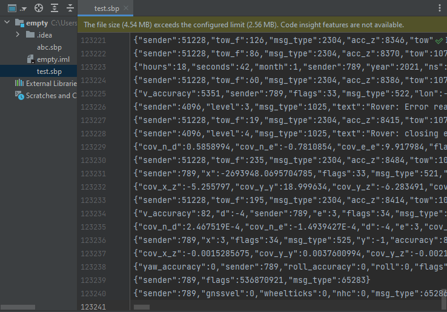

# sbp-idea

Available on the [JetBrains Marketplace](https://plugins.jetbrains.com/plugin/20731-sbp)

JetBrains plugin of Swift Binary Protocol, refer to [libsbp](https://github.com/swift-nav/libsbp/tree/master/java)

Covers underlying binary file type `.sbp`, decompiling file into human readable JSON format.

[WIP] 
- Editing
- Queries
- Autocomplete / Hinting

Currently simple decompilation of sbp file as POC

